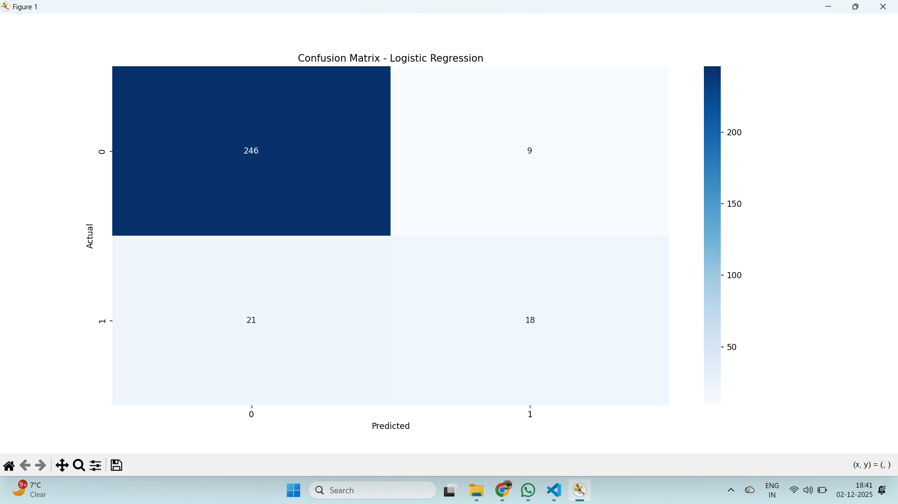
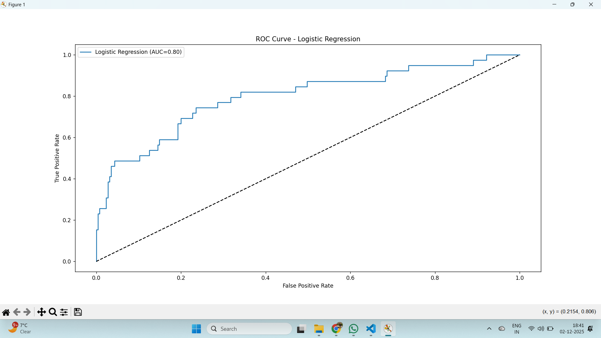
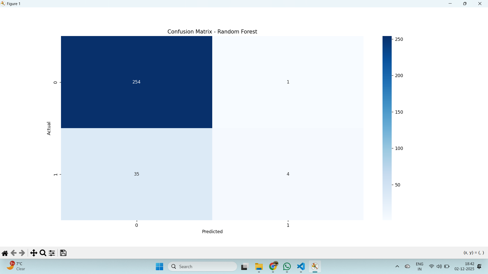
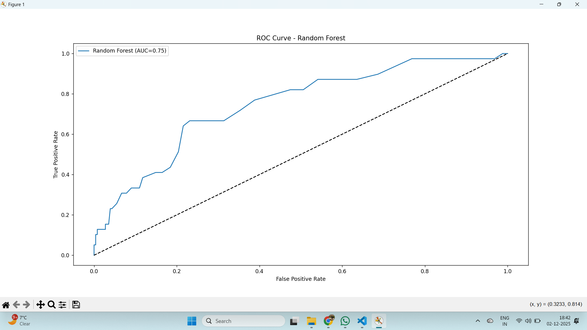

HR Analytics – Employee Attrition Prediction

 This project predicts employee attrition (whether an employee will leave or stay) using machine learning models. It is a full end-to-end pipeline, from data cleaning to feature engineering, model training, evaluation, and actionable insights.

1. Motivation

Employee attrition is costly for companies. Predicting which employees are at risk of leaving helps HR teams take proactive steps to retain talent.  

- Identify high-risk employees  
- Improve employee satisfaction  
- Optimize HR policies  

2. Dataset

- Source: Kaggle HR Analytics dataset  
- Number of rows: 1470  
- Number of features: 35  
- Key columns:
  - Age
  - Attrition (target)
  - Business Travel
  - Department
  - Distance from Home
  - Job Role
  - Monthly Income
  - Years at Company
  - And more…

*Note:* The target column is Attrition (Yes = 1, No = 0).

3. Methodology / Pipeline

1. Data Processing
   - Load CSV dataset
   - Handle missing values
   - Remove duplicates
   - Standardize column names  

2. Feature Engineering
   - One-hot encode categorical variables
   - Scale numeric features
   - Split features (X) and target (y)  

3. Model Training & Evaluation
   - Train Logistic Regression and Random Forest models
   - Evaluate using:
     - Accuracy
     - Precision
     - Recall
     - F1 Score
     - AUC
   - Plot Confusion Matrix & ROC Curve
   - Save best model (best_attrition_model.pkl)  

4. EDA (Exploratory Data Analysis)
   - Attrition by Job Role / Department  
   - Attrition by Salary Band  
   - Correlation heatmap  

5. Actionable Insights
   - Employees with low salary hikes and long commute distance are more likely to leave  
   - Targeted retention strategies can reduce attrition  

4. Model Performance

Logistic Regression

 Random Forest

5. How to Run

1. Make sure you have all required libraries:
pip install pandas numpy scikit-learn matplotlib seaborn joblib dataframe_image